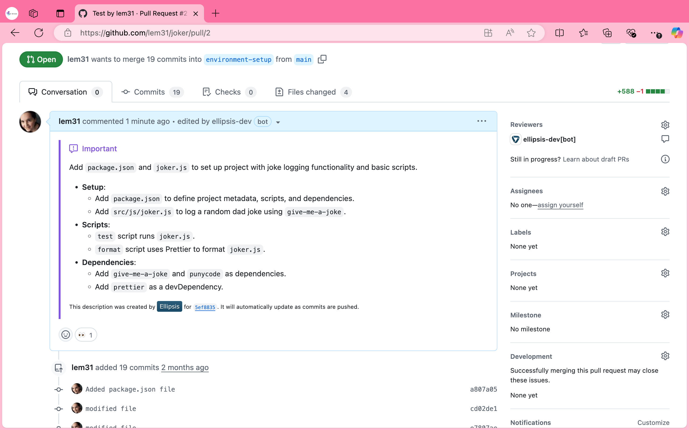
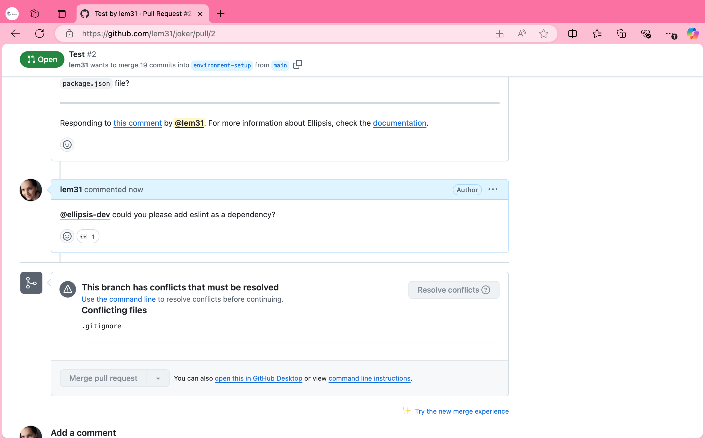
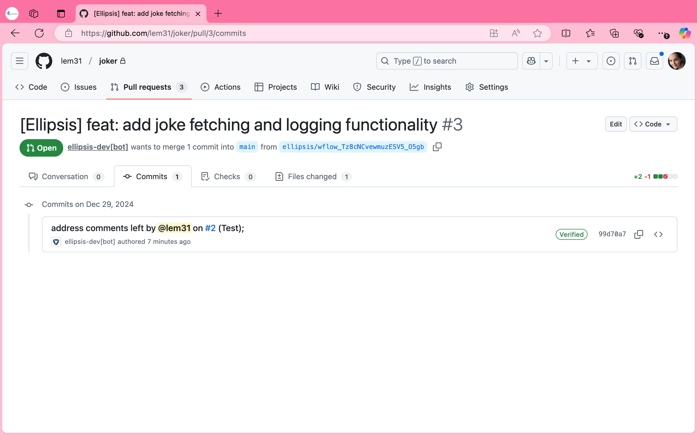

# A Case Study on the Development Tool Ellipsis and similar products

## Introduction and history

Ellipsis is a for profit company, founded in 2023 by Hunter Brooks and Nick Bradford with headquaters located in New York, USA. 

It is a startup, which has been running for just 2 years. 

It currently has 13 investors, the two most recent being TwentyTwo VC and Brad Flora.

In this last year, it has raised over $2million. In February 2024 it raised $500,000 from Y Combinator and in April 2024 it raised $2million from Amino Capital and 11 other investors.

## Using Ellipsis

Ellipsis have created a developer tool called Ellipsis for reviewing code and fixing bugs. 

You have to pay to use their product but they do currently offer a 7 day free trial, after that it is $20 per month, per user. For enterprises, they have additional options but you have to contact them for pricing. 

Their tool can review code, fix bugs, create pull request summaries, generate standup reports, create implementation plans and respond to any questions you ask it regarding your codebase. 

I am going to be looking at it’s ability to review pull requests and fix bugs. 

When you make a pull request, the AI tool automatically provides you with a review and summary, which it continues to update, as you push more code. 

It will also automatically flag any bugs, such as, logical errors, anti-patterns, security issues, spelling and grammar mistakes, documentation drift and more.

When it finds an error, it automatically adds a comment to the line that contains the error. You can then write a comment using the tag @ellipsis-dev and the app will create code to fix the error.

The application uses LLM’s to generate the pull request summaries and comments/suggestions for fixing code. LLM stands for Large Language Model and according to IBM “Large language models (LLMs) are a category of foundation models trained on immense amounts of data making them capable of understanding and generating natural language and other types of content to perform a wide range of tasks.”
 Ibm. (2024, December 19). Large language models. What are large language models (LLMs)? https://www.ibm.com/think/topics/large-language-models

It has a dashboard in the application where you can see pull request data, such as, the number of merged pull requests, total lines changed and you can also add code review rules. 

### Dashboard Images

## Pros and cons of Ellipsis

### Pros

- Any code that it generates, when fixing bugs, it runs and tests, so that it is actual working code, unlike other AI tools.

- They have a 7 day free trial period. 

- It can be used on Github or Gitlab and is easily and quickly installed.

- You can even add your own review rules either in the UI or in the ellipsis.yaml file.

- They have a video demo on their website.

- According to their own data, “teams that use Ellipsis merge pull requests 13% faster than those that don’t”
 “Introduction - Ellipsis | AI Code Reviews and Bug Fixes.” Ellipsis | AI Code Reviews &
Bug Fixes, docs.ellipsis.dev/introduction.

- When testing the application myself, I found that the pull request summary was very detailed 
and well written. When sending a comment with the @ellipsis-dev tag, eyes appear at the 
bottom of the comment, so you know the bot is reading the comment. Furthermore, the bot is 
very handy, I asked the bot to add a dependency and it created a new pull request addressing 
this within less than a minute. please see screenshots, below:

### Pull request summary 

### Loading eyes when sending comment to bot

### Bot’s helpful response

### Pull request created by bot 

### Cons

I was unable to find any reviews on this tool, so i tested it myself.

- I found the bot a bit slow when initially loading comments on your pull request, when you first create the pull request so I thought it wasn’t working but it just takes a while to load. It could be good if there was some kind of indication or message on the screen to let you know that the bot is loading comments, like it does when you send a question to the bot and the eyes display at the bottom of your comment (see image above). 

- I also thought it would be better if you didn’t have to use the tag when sending a comment to Ellipsis, as I did forget this once and was confused when it didn’t work. So I think that people could easily forget to add the tag and this could slow down the whole process slightly.

## Other Similar Products

### Squire AI

Squire AI is an agentic code review and quality platform founded in 2021 by Saumil Patel, Brandon Waselnuk and Karl Clement with headquarters located in San Francisco, USA. It has created a similar tool to Ellipsis and its current features are AI code review, pull request summaries, enforce rules and chat with your Squire.

So, like Ellipsis it reviews code and creates pull request summaries. 

According to their data, the teams they work with merge pull requests 21% faster, so that would be 8% faster than Ellipsis.

However, unlike Ellipsis it only seems possible to connect to Github and not Gitlab. 

My first impressions of this platform were not great, as I was unable to login with my GitHub account, which is a shame because I was therefore unable to try out the application myself.

 I’m not sure if this is because it is a paid application or if there is another issue. There does not seem to be any kind of trial available, so this may be the reason but if it is the reason then they should make it clearer on their site and specify this. 

The only error that appears on the screen is ”We could not authenticate you, please contact us for support” and when I click on ”contact us” I am redirected to a new browser page, with no way to contact them, so that is not helpful.

As stated, they also don’t currently have a free trial period and the price is $20 per month, per user, they also have additional pricing options for companies with over 100 users but you need to contact them for pricing. In my opinion this sounds a bit more restricted compared to Ellipsis, as they don’t specify a limit for the number of users for their enterprise pricing options. 

Some additional cons that I found are that it doesn’t support real-time collaboration and there is a learning curve for configuration. 

In comparison, I can’t speak for the real-time collaboration but I found Ellipsis very easy to install and there is a clear tab on the dashboard where you can add your own rules. 

I thought it was great that they have a video demo on their website (https://tracxn.com/d/companies/squire-ai/__rD8tFn8NOOdMVqIaSaUHJaNCZSkyLVsMbJL7qvwCBRU#about-the-company) , just like Ellipsis, this is very helpful and shows you how it works. I noticed that it seems to work like Ellipsis and automatically generates a pull request summary and comments on the code. 

You can then reply to the bot (Squire in this case) and you don’t have to reference Squire in the comment, you can just write the comment without any tag, which makes it slightly easier.

As stated previously, I found that having to add the tag when sending a comment to the Ellipsis bot could potentially slow down the process if people forget they have to add it, as I did. 

Just like Ellipsis, you can also add your own rules/standards for reviewing code. However, in the demo for Squire it doesn’t mention anything about actually fixing bugs like Ellipsis does, the bot just seems to provide feedback, which you can then decide to implent or not. It would therefore not be possible to ask the bot to implement it for you, like you can with Ellipsis. I prefer Ellipsis in this regard because I think it’s great that you can ask it to implement code for you and this would definitely speed up the review process. 

Squire uses an agentic workflow to review code and write pull requests. “Agentic 
workflows represent sequences of well-defined jobs to be done that are executed dynamically 
by AI agents and orchestrated as part of a larger end-to-end business process automation. In 
this way, agentic workflows are the application of AI agents to process automation.”
Anywhere, A. (n.d.). Agentic Workflows: Everything you need to know. Automation 
Anywhere. https://www.automationanywhere.com/rpa/agentic-
workflows#:~:text=Agentic%20workflows%20represent%20sequences%20of,AI%20agents
%20to%20process%20automation.

### Qodo

Qodo is a software development company, which was founded in 2022 by Itamar Friedman. It’s headquarters are located in Tel Aviv, Israel. They currently have 10 investors and have raised $51M so far. 

The company has developed an AI coding platform called Qodo, which has a specific tool for handling pull requests, called Qodo Merge.

Qodo Merge is a similar tool to Ellipsis, which helps review and handle pull requests. 

The advantage of this tool is that they have an open source version, which is free to use, unlike Ellipsis and Squire AI. However, the installation of the free version is not as simple as the pro version. For example, on Github you would have to create an action with the yml file that they provide you with and add a secret to your repo with an open AI key. 

There are also some functions of the tool that can only be accessed with the pro version.

Qodo’s pro version is an app that is easy to install and starts at $19/month, which is slightly cheaper than Ellipsis and Squire AI. They also currently have a 14 day free trial period for the pro version, which is longer than Ellipsis’s trial period.

Another benefit of Qodo Merge is that the self-hosted version can be used locally or with GitHub, GitLab, BitBucket or Azure DevOps and the pro version can be used on GitHub, GitLab and BitBucket. You, therefore, have more options when it comes to where you can use this platform than you do with Ellipsis or Squire AI.

This platform seems to work slightly differently from the other two, where instead of just chatting with the bot on pull requests, you have to add certain tags, like Review, Describe Improve, Ask, PR Chat, Analyze, Test and more. This seems a bit more complex and less user friendly to me because you have to find the correct tag to use in your PR chat depending on what you want help with or what you want to achieve. For example, to test the code you have to use the test tag, whereas with Ellipsis, any code it provides you with is automatically run and tested by the application, which saves a lot of time. It also does not seem to be able to update the code for you like Ellipsis does but rather provides code suggestions, similar to Squire AI.  

## Conclusion

Overall I think this is a great product and I can see how it would speed up the process of reviewing code and potentially spot errors that the human eye might not. 

However, I would not want to rely on it too heavily and still have the code looked over by humans as well, just to ensure the quality of the code was up to standard. 

I think it would also be good if it could be used on more platforms than it currently seems to be. 

Qodo has a few benefits that Ellipsis does not, such as, a longer free trial period for the pro version, an open source version and it can be used on more platforms, Additionally, Squire AI has a simpler chat, as you don’t have to add any tags when commenting on pull requests.  

However, I still prefer Ellipsis overall because I believe Ellipsis is easier to use and it also implements code for you, which the other two tools do not.

I look forward to seeing how this product develops in the future.

## Sources

https://www.ellipsis.dev/

docs.ellipsis.dev/introduction

https://www.crunchbase.com/organization/bitbuilder-91a2

https://www.ibm.com/think/topics/large-language-models

https://www.squire.ai/

https://tracxn.com/d/companies/squire-ai/__rD8tFn8NOOdMVqIaSaUHJaNCZSkyLVsMbJL7qvwCBRU#about-the-company

https://theresanaiforthat.com/ai/squire-ai/

https://www.automationanywhere.com/rpa/agentic-workflows#:~:text=Agentic%20workflows%20represent%20sequences%20of,AI%20agents
%20to%20process%20automation.

